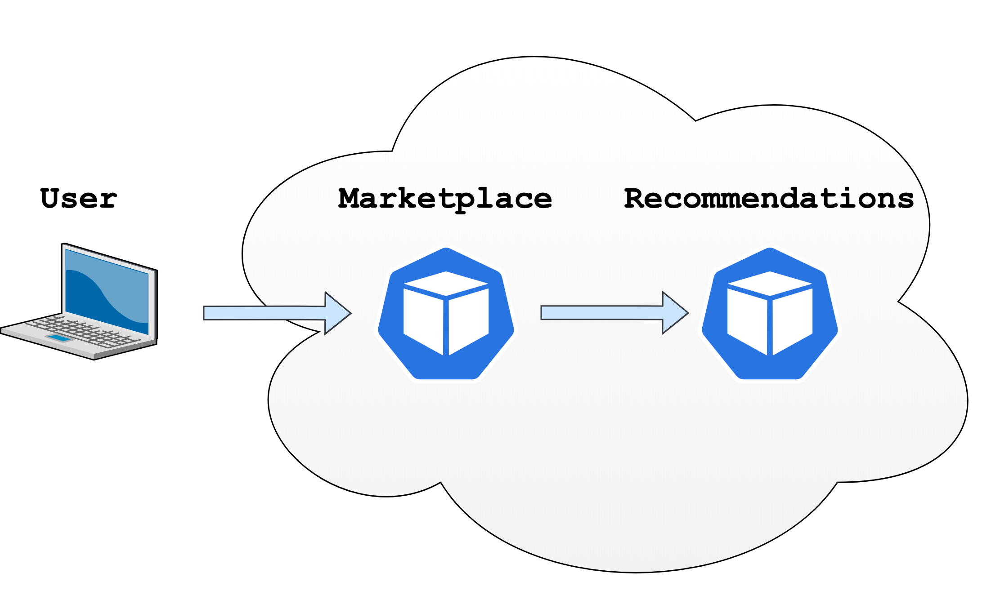

# Online Book Store

## Microservices implementation in Python

### This project has two microservices.
1. Marketplace - minimal web app that displays a list of books to the user.
2. Recommendations - provides a list of books in which the user may be interested.

## Deployment
- There are two microservices `marketplace` and `recommendations`
- Currently, both are hosted in docker-hub `kathansheth/marketplace:latest` and `kathansheth/recommendations:latest` respectively.
- Follow the instructions to deploy it on Docker Desktop with local kubernetes cluster.

## Instructions to run services
- Run `kubectl apply -f kubernetes.yaml` to start both microservices.
- Go to `localhost:5000` to get books recommendations.

## Instructions for monitoring
- Currently, Resource Metric pipeline is setup for this project, which provides basic resource (CPU and Memory) monitoring.
- We need to deploy Metric API into the cluster, so that the client can query for basic resource information.
- We need to first install and deploy metric-server which fetches resource metrics from the kubelets and exposes them in the Kubernetes API server through the Metrics API.
- metric-server is not installed with Docker desktop. It can be deployed by installing it from `https://github.com/kubernetes-sigs/metrics-server/releases/download/metrics-server-helm-chart-3.8.2/components.yaml`
- Have `component.yaml` file is included within this project and can be deployed using `kubectl apply -f components.yaml`
- Need to add `--kubelet-insecure-tls` under the args section in case you are downloading it from Github. (Kubelet certificate needs to be signed by cluster Certificate Authority (or disable certificate validation by passing --kubelet-insecure-tls to Metrics Server))
- Run `kubectl top node`, `kubectl top pod -A` to see resource utilization.

## Instructions for kubernetes dashboard
- To access the dashboard, first we need to execute `kubectl apply -f https://raw.githubusercontent.com/kubernetes/dashboard/v2.7.0/aio/deploy/recommended.yaml` command.
- To access Dashboard from your local workstation you must create a secure channel to your Kubernetes cluster. For this need to start proxy using `kubectl proxy`
- Access the dashboard `http://localhost:8001/api/v1/namespaces/kubernetes-dashboard/services/https:kubernetes-dashboard:/proxy/`
- It needs a `token` to access dashboard.
- For that, we need to create a service account and ClusterRoleBinding for that account.
- Have copied `dashboard-adminuser.yaml` and `dashboard-clusterrolebinding.yaml` files within project.
- Run `kubectl apply -f dashboard-adminuser.yaml`
- Run `kubectl apply -f dashboard-clusterrolebinding.yaml`
- And then `kubectl -n kubernetes-dashboard create token admin-user` to generate token.
- Use this token to see dashboard.

## Important links

- (https://github.com/kubernetes-sigs/metrics-server)
- (https://github.com/kubernetes/dashboard)
- (https://kubernetes.io/docs/tasks/debug/debug-cluster/resource-metrics-pipeline/)
- (https://realpython.com/python-microservices-grpc/#production-ready-python-microservices)

